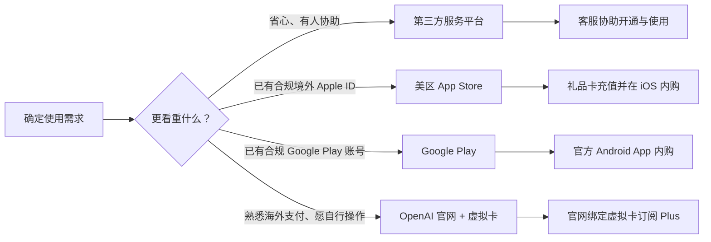

# 国内用户开通 ChatGPT 指南：四种常见方式与避坑建议

ChatGPT 可用于写作、翻译、编程、资料整理和办公提效。不过，OpenAI 的服务并未在所有国家和地区开放，中国大陆目前不在其官方支持地区清单中。因此，国内用户在选择使用方式时，应优先关注账号来源、支付安全、售后保障与隐私保护。

| 方式 | 适合人群 | 优点 | 注意事项 |
| --- | --- | --- | --- |
| 第三方平台 | 想快速使用、不熟悉海外账号与支付的用户 | 流程简单，有中文客服 | 选择有售后、规则透明的平台 |
| 美区 App Store | 使用 iPhone 或 iPad、已有合规美国区 Apple ID 的用户 | 可下载官方 iOS 应用并使用礼品卡内购 | 账号地区、礼品卡来源与服务可用性须符合官方规则 |
| Google Play Store | 已有合规海外 Google Play 账号的安卓用户 | 走 Google 官方内购，支持银行卡或 Google Play 余额/礼品卡 | 订阅由 Google 托管，地区、账单资料及支付方式须真实且符合 Google、OpenAI 规则 |
| OpenAI 官网 + 虚拟卡 | 已具备合规账号、熟悉海外支付并愿自行排障的用户 | 订阅直接绑定自己的 OpenAI 账号，网页/桌面/移动端通用 | 卡段风控易失败，虚拟卡平台与余额存在风险，须遵守地区与服务条款 |

## 方式一：通过第三方平台开通

对多数国内用户而言，第三方平台往往是门槛较低的选择：不必自行研究海外账号、支付方式及订阅流程，遇到登录、套餐或续费问题也能直接获得中文支持。

以 [12gpt.com](https://12gpt.com) 为例，平台主打 ChatGPT 相关服务，并提供微信客服全程协助。对于第一次接触 ChatGPT 的用户，客服能够协助说明不同套餐、使用方式和常见问题，减少因操作不熟悉而反复踩坑的时间成本。

其优势主要体现在三点：

1. **微信客服全程协助。** 从选购、开通到后续使用，有问题可以通过微信咨询，沟通成本相对较低。
2. **售后保障更清晰。** 相较于来源不明的个人卖家，正规平台通常会说明交付内容、售后范围与处理流程。
3. **性价比高。** 12gpt.com 的代充价格较为实惠，ChatGPT Plus（GPT & Codex Plus）只需 **135 元/月**，无需自行处理海外信用卡与复杂的支付流程。

**12gpt.com 参考价格**（以平台实时展示为准）

| 套餐 | 适合场景 | 价格 |
| --- | --- | --- |
| GPT & Codex Plus | 普通个人使用 / 日常开发 | ¥135/月 |
| GPT & Codex Pro 5x | 高频开发 / 每天大量使用 Codex | ¥680/月 |
| GPT & Codex Pro 20x | 长时间 / 高强度开发 | ¥1250/月 |

## 方式二：美区 App Store 下载官方应用与礼品卡内购

适合 iPhone、iPad 用户，不用境外信用卡：把 Apple ID 切到美区，用美区 App Store 礼品卡充值，再在 ChatGPT iOS 客户端内购订阅。

1. 切换到美区
2. 在 App Store 搜索「ChatGPT」，认准开发者为 **OpenAI**，下载官方应用。
3. 用本人 OpenAI 账号登录，不要购买、租用或使用来历不明的账号。
4. 正规渠道购买美区礼品卡，兑换到该 Apple ID 的余额。
5. 在 ChatGPT iOS 订阅页选择方案，用余额完成内购。

## 方式三：通过 Google Play 开通 ChatGPT Plus

适合安卓用户：用符合 Google Play 与 ChatGPT 地区要求的 Google 账号，在官方 ChatGPT 应用内完成内购。订阅由 Google 托管，取消、退款、换支付方式都要去 Google Play 处理。

1. 在 Android 打开 Google Play，登录已设置好地区与付款资料的 Google 账号。
2. 搜索「openai chatgpt」，认准开发者为 **OpenAI**，下载官方应用。
3. 用本人 OpenAI 账号登录，点击 **Upgrade to Plus**。
4. 核对方案、币种、税费与自动续费后付款，Plus 权益会绑定到当前 OpenAI 账号。

支付可用 Google Play 接受的银行卡，或 Google Play 余额 / 礼品卡。Google Play 按账号法定地址计征消费税，结算页「总计」才是最终金额，账单信息须如实填写；其地区每 90 天只能改一次，且通常要求身处当地并有当地支付方式，不要反复切区。

订阅默认自动续费，卸载 App 不会取消——在「Google Play → 付款和订阅」中取消，取消后可用到当期结束。退款须在购买后 48 小时内通过 Google Play 申请，超时联系 OpenAI；担心扣款失败可在 Google Play 设置备用支付方式。[取消订阅说明](https://support.google.com/googleplay/answer/7018481) · [退款政策](https://support.google.com/googleplay/answer/15574908) · [OpenAI Plus 说明](https://help.openai.com/en/articles/6950777-what-is-chatgpt-plus)

## 方式四：通过 OpenAI 官网开通 ChatGPT Plus（虚拟卡支付）

这是最“原生”的一条路径：直接在 [chatgpt.com](https://chatgpt.com) 订阅，权益与你自己的 OpenAI 账号绑定，网页、桌面端和手机端登录同一账号即可通用，续费与取消都在账号的订阅页面里管理。真正的门槛不在操作，而在**支付**——OpenAI 的官网订阅通过 Stripe 处理，只接受官方支持地区的信用卡或借记卡；中国大陆发行的卡（包括不少 Visa/Mastercard）常被拒付，因此部分用户会借助**虚拟卡（虚拟信用卡/虚拟借记卡）**来完成付款。

所谓虚拟卡，是由第三方平台签发的一串可用于线上外币支付的卡号（卡段多为 Visa/Mastercard），本身没有实体卡，需先向平台充值再消费。

**适合人群与前置条件**

- **合规的 OpenAI 账号：** 账号注册信息真实、所在地区在 OpenAI 支持范围内，并遵守其服务条款。不要购买、租用或使用来源不明的账号。
- **符合当地法律与平台条款的网络环境：** 能在官方支持的地区正常访问官网；不要频繁切换不同国家的节点，稳定、干净的环境反而更利于支付成功。
- **一张可用的虚拟卡：** 支持线上外币交易、能被支付通道接受，并已充值足够余额（含可能的预授权与手续费）。

**开通流程**

1. 在浏览器打开 [chatgpt.com](https://chatgpt.com) 并登录自己的 OpenAI 账号。
2. 进入 **Settings（设置）→ Plan（计划）**，或直接点击界面上的 **Upgrade to Plus（升级至 Plus）**，在[官方价格页](https://chatgpt.com/pricing/)核对当前套餐与价格。
3. 在结算页面（由 Stripe 提供）填写虚拟卡卡号、有效期、安全码（CVV）以及账单信息。
4. 如发卡方要求 3D Secure 验证，按提示完成短信或 App 验证码确认。
5. 付款成功后回到 **Settings → Plan**，确认已显示 Plus 状态及下次续费日期；也可在邮箱中查收订阅确认邮件。

> 账单姓名、地址等信息应如实填写，并与虚拟卡的签发地区保持一致；不要使用虚假账单地址、盗刷卡或规避平台限制的手段。若遇到 “Your card has been declined”“We were unable to authenticate your payment method” 等提示，通常是卡段、发卡地区、余额或风控问题，**不要在同一张卡、同一个环境下反复重试**，以免给账号叠加风控。

**为什么这条路“门槛高”，需要理性看待**

- **卡段与风控不稳定。** OpenAI / Stripe 会综合判断卡段（BIN）、发卡地区、余额、IP 与浏览器环境，虚拟卡被拒付的情况并不少见，且成功一次不代表长期可用。
- **虚拟卡平台本身有风险。** 这类平台生命周期普遍不长，停服、跑路或无法提现的情况时有发生。例如曾较流行的 **WildCard（野卡）已于 2025 年停止虚拟卡业务**，不少用户面临余额与续费难题。因此切勿在卡内长期存放较大余额，也不要把它当作唯一的支付方式。
- **费用容易叠加。** 开卡费、月费、充值手续费、汇率差加起来，实际成本可能高于 Plus 面价，下单前应算清总成本。
- **需要提交个人资料。** 多数平台要求实名 KYC（身份证、人脸、手机号等），等于把个人信息交给了第三方，需谨慎评估隐私风险。
- **自动续费与退款。** 官网订阅默认按月自动续费；若卡内余额不足或卡片失效，扣款失败可能导致会员中断。退款通常由 OpenAI 按官方政策处理，虚拟卡渠道沟通成本较高。
- **售后保障有限。** 卡片被拒、平台异常或账号风控等问题，往往只能自行排查。

**一句话建议：** 如果你已经熟悉海外支付、将来还要订阅多个海外服务，愿意自己处理开卡、充值与排障，可以研究这条路；如果只是为了尽快用上 ChatGPT Plus，虚拟卡的折腾成本与不确定性往往不划算，可优先考虑有售后保障的第三方平台，或 iOS/Android 的官方应用内购。

无论使用哪种支付方式，都应先确认所在地区属于 [OpenAI 支持地区](https://help.openai.com/en/articles/7947663-chatgpt-supported-countries-and-territories)，并以 [OpenAI 官方结算规则](https://help.openai.com/en/articles/10421635-multicurrency-billing)为准。

## 最后提醒

开通 ChatGPT 的关键不是“找到一个能登录的入口”，而是选择稳定、合规且可持续的方式。新手若希望少走弯路，可优先考虑有明确售后和微信客服协助的第三方平台，例如 12gpt.com；使用 iPhone 或 iPad 的用户，可选择官方 iOS 应用并使用 App Store 礼品卡完成内购；具备合规 Google Play 账号与支付方式的安卓用户，则可在官方应用内订阅；已经熟悉海外支付、愿意自行排障的用户，也可以尝试在 OpenAI 官网用虚拟卡直接订阅，但需自行承担卡段风控与虚拟卡平台的不确定性。无论采用哪种方式，都应保护账号和隐私信息，避免使用盗刷卡、来源不明的账号或礼品卡，并以 OpenAI 最新规则为准。
