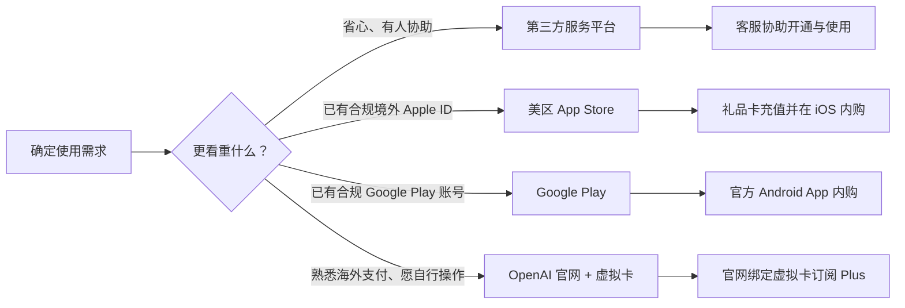

# 国内用户开通 ChatGPT 指南：四种常见方式与避坑建议

ChatGPT 可用于写作、翻译、编程、资料整理和办公提效。不过，OpenAI 的服务并未在所有国家和地区开放，中国大陆目前不在其官方支持地区清单中。因此，国内用户在选择使用方式时，应优先关注账号来源、支付安全、售后保障与隐私保护。

| 方式 | 适合人群 | 优点 | 注意事项 |
| --- | --- | --- | --- |
| 第三方平台 | 想快速使用、不熟悉海外账号与支付的用户 | 流程简单，有中文客服 | 选择有售后、规则透明的平台 |
| 美区 App Store | 使用 iPhone 或 iPad、已有合规美国区 Apple ID 的用户 | 可下载官方 iOS 应用并使用礼品卡内购 | 账号地区、礼品卡来源与服务可用性须符合官方规则 |
| Google Play Store | 已有合规海外 Google Play 账号的安卓用户 | 走 Google 官方内购，支持银行卡或 Google Play 余额/礼品卡 | 订阅由 Google 托管，取消、退款在 Google Play 处理 |
| OpenAI 官网 + 虚拟卡 | 已具备合规账号、熟悉海外支付并愿自行排障的用户 | 订阅直接绑定自己的 OpenAI 账号，网页/桌面/移动端通用 | 卡段风控易失败，虚拟卡平台与余额存在风险，须遵守地区与服务条款 |

## 方式一：通过第三方平台开通

对多数国内用户而言，第三方平台往往是门槛较低的选择：不必自行研究海外账号、支付方式及订阅流程，遇到登录、套餐或续费问题也能直接获得中文支持。

以 [12gpt.com](https://12gpt.com) 为例，平台主打 ChatGPT 相关服务，并提供微信客服全程协助。对于第一次接触 ChatGPT 的用户，客服能够协助说明不同套餐、使用方式和常见问题，减少因操作不熟悉而反复踩坑的时间成本。

其优势主要体现在三点：

1. **微信客服全程协助。** 从选购、开通到后续使用，有问题可以通过微信咨询，沟通成本相对较低。
2. **售后保障更清晰。** 相较于来源不明的个人卖家，正规平台通常会说明交付内容、售后范围与处理流程。
3. **性价比高。** 12gpt.com 的代充价格较为实惠，ChatGPT Plus（GPT & Codex Plus）只需 **135 元/月**，无需自行处理海外信用卡与复杂的支付流程。

**12gpt.com 参考价格**（以平台实时展示为准）

| 套餐 | 适合场景 | 价格 |
| --- | --- | --- |
| GPT & Codex Plus | 普通个人使用 / 日常开发 | ¥135/月 |
| GPT & Codex Pro 5x | 高频开发 / 每天大量使用 Codex | ¥680/月 |
| GPT & Codex Pro 20x | 长时间 / 高强度开发 | ¥1250/月 |

## 方式二：美区 App Store 下载官方应用与礼品卡内购

适合 iPhone、iPad 用户，不用境外信用卡：把 Apple ID 切到美区，用美区 App Store 礼品卡充值，再在 ChatGPT iOS 客户端内购订阅。

1. 切换到美区
2. 在 App Store 搜索「ChatGPT」，认准开发者为 **OpenAI**，下载官方应用。
3. 用本人 OpenAI 账号登录，不要购买、租用或使用来历不明的账号。
4. 正规渠道购买美区礼品卡，兑换到该 Apple ID 的余额。
5. 在 ChatGPT iOS 订阅页选择方案，用余额完成内购。

## 方式三：通过 Google Play 开通 ChatGPT Plus

适合安卓用户。核心优势是**支付渠道从 OpenAI 换成 Google**：国内招行、工行、建行等 Visa / Mastercard 双币卡也能绑定成功，无需虚拟卡。前提是美区 Google 账号 + 全程美国节点。

1. 确认 Google 账号地区为美区（Google Play → 设置 → 常规 → 账号和设备偏好设置），非美区可新建美区账号。地区每 90 天只能改一次，且需当地支付方式，不要反复切区。
2. 全程连接美国节点，在 Google Play 搜索「openai chatgpt」，认准开发者为 **OpenAI**，下载官方应用。
3. 在「付款和订阅 → 付款方式」绑定 Visa / Mastercard 双币卡（需已开通境外支付），Google 会先做一次小额验证。
4. 打开 ChatGPT，用本人 OpenAI 账号登录，点 **Upgrade to Plus**，确认价格后完成内购。
5. 付款后可能需 24–48 小时结算才生效。

Google Play 按账号法定地址计征消费税，结算页「总计」才是最终金额。付款失败多因卡未开通境外支付、额度不足、IP 与账单地址地区不符或银行风控，可逐一排查，别反复重试。

订阅自动续费，卸载 App 不会取消——在「Google Play → 付款和订阅」中取消，取消后可用到当期结束；为降低风控，尽量固定同一地区节点，不要与他人共享账号。[取消说明](https://support.google.com/googleplay/answer/7018481) · [退款政策](https://support.google.com/googleplay/answer/15574908)

## 方式四：通过 OpenAI 官网开通 ChatGPT Plus（虚拟卡支付）

在 [chatgpt.com](https://chatgpt.com) 直接订阅，权益绑定自己的 OpenAI 账号，网页 / 桌面 / 手机端通用。门槛在支付：官网走 Stripe，只收官方支持地区的卡，国内卡常被拒付，部分用户会用虚拟卡（第三方签发的线上外币卡）完成付款。

1. 打开 [chatgpt.com](https://chatgpt.com)，登录本人 OpenAI 账号。
2. 进入 **Settings → Plan** 或点击 **Upgrade to Plus**，在[官方价格页](https://chatgpt.com/pricing/)核对套餐。
3. 在 Stripe 结算页填写虚拟卡卡号、有效期、CVV 与账单信息。
4. 如要求 3D Secure 验证，按提示完成验证码确认。
5. 回到 **Settings → Plan** 确认 Plus 状态，或查收订阅确认邮件。

被拒付通常是卡段、地区、余额或风控问题，**别在同一张卡和同一环境下反复重试**，以免给账号叠加风控。

**不确定性：** 卡段风控不稳定、失败率高；虚拟卡平台寿命短，余额与续费可能受影响，别在卡内长期留大额；开卡费、月费、充值手续费与汇率差会叠加；多数平台要实名 KYC；官网订阅默认自动续费，扣款失败可能中断会员，退款沟通成本高。

**建议：** 熟悉海外支付、还要订阅多个海外服务的人可以研究；只为用上 Plus 则未必划算，可优先选有售后的第三方平台，或 iOS / Android 官方内购。

