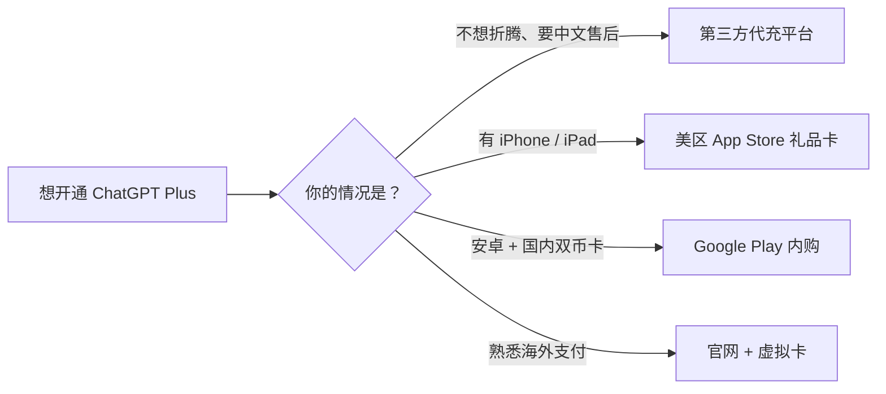

# 国内用户开通 ChatGPT Plus 指南：四种方式对比（2026）

ChatGPT 可用于写作、翻译、编程与办公提效，但中国大陆不在 OpenAI 官方支持地区内，直接开通常卡在**账号**和**支付**两步。本文对比四种常见开通方式，供不同情况的用户参考。

## 为什么国内开通 ChatGPT 比较难

- **地区限制：** 中国大陆不在官方支持地区范围内，注册与使用都可能受限。
- **支付受限：** 官网订阅走 Stripe 收单，国内银行卡常被拒付。
- **订阅体系三套并存：** 官网、iOS、Google Play 的订阅相互独立，容易混淆续费与取消入口。

因此，选择方式时重点看四点：**账号来源是否可靠、支付是否安全、有没有售后、隐私是否有保障。**

## 四种方式对比

| 方式 | 成本（约） | 难度 | 适合人群 | 关键提示 |
| --- | --- | --- | --- | --- |
| 第三方代充平台（如 12gpt.com） | ¥135/月起 | 低 | 想快速用、要中文售后 | 无需海外卡，无需密码 |
| 美区 App Store | 官方 $20 + 礼品卡 | 中 | iPhone / iPad 用户 | 需切区，礼品卡须正规 |
| Google Play | 官方 $20 + 税 | 中 | 安卓 + 国内双币卡 | 需美区账号 + 美国节点 |
| 官网 + 虚拟卡 | 官方 $20 + 卡费用 | 高 | 熟悉海外支付的人 | 卡段风控高，虚拟卡平台易停服 |

## 方式一：通过第三方代充平台开通

对多数国内用户而言，第三方平台门槛较低：不必研究海外账号与支付方式，遇到登录、套餐或续费问题也能直接获得中文支持。以 [12gpt.com](https://12gpt.com) 为例，平台主打 ChatGPT 代充服务，并提供微信客服协助。

**参考价格**（以平台实时展示为准）

| 套餐 | 适合场景 | 价格 |
| --- | --- | --- |
| GPT & Codex Plus | 普通个人使用 / 日常开发 | ¥135/月 |
| GPT & Codex Pro 5x | 高频开发 / 每天大量使用 Codex | ¥680/月 |
| GPT & Codex Pro 20x | 长时间 / 高强度开发 | ¥1250/月 |

**主要特点**

- **省心：** 微信 / 支付宝付人民币即可，无需海外信用卡，也不用切换 Apple ID 或 Google Play 地区。
- **安全：** 充值到**你自己的 OpenAI 账号**，全程**无需提供 ChatGPT 密码**。
- **有售后：** 选购、开通、续费与异常处理都有中文客服协助，规则和交付内容更透明。
- **价格：** 以 Plus 为例，代充价通常低于官方 $20/月（约 145 元）外加海外卡门槛的综合成本。
- **全平台通用：** 权益绑定你的 OpenAI 账号，网页、桌面端、手机端登录同一账号都能用。

**开通流程**

1. 打开 [12gpt.com](https://12gpt.com)，按需求选择套餐并支付（微信 / 支付宝）。
2. 按页面或客服指引，用自己的 OpenAI 账号完成核对（**不需要交出密码**）。
3. 到账后打开 [chatgpt.com](https://chatgpt.com)，在 **Settings → Plan** 确认已显示 Plus 状态。

## 方式二：美区 App Store 下载官方应用与礼品卡内购

适合 iPhone、iPad 用户，不用境外信用卡：把 Apple ID 切到美区，用美区 App Store 礼品卡充值，再在 ChatGPT iOS 客户端内购订阅。

1. 切换到美区（「设置」→ Apple 账户 → 「媒体与购买项目」→ 「国家/地区」→ 选美国并同意条款）。切换前需用完余额、取消会阻止切换的订阅。
2. 在 App Store 搜索「ChatGPT」，认准开发者为 **OpenAI**，下载官方应用。
3. 用本人 OpenAI 账号登录，不要购买、租用或使用来历不明的账号。
4. 正规渠道购买美区礼品卡，兑换到该 Apple ID 的余额。
5. 在 ChatGPT iOS 订阅页选择方案，用余额完成内购。

订阅由 Apple 扣款，续费与取消在「设置 → Apple 账户 → 订阅」处理，卸载 App 不会取消。礼品卡须来源正规、且与账户地区一致；如果不想处理切区与礼品卡，也可以考虑有售后的第三方代充平台。

## 方式三：通过 Google Play 开通 ChatGPT Plus

适合安卓用户。核心优势是**支付渠道从 OpenAI 换成 Google**：国内招行、工行、建行等 Visa / Mastercard 双币卡也能绑定成功，无需虚拟卡。前提是美区 Google 账号 + 全程美国节点。

1. 确认 Google 账号地区为美区（Google Play → 设置 → 常规 → 账号和设备偏好设置），非美区可新建美区账号。地区每 90 天只能改一次，且需当地支付方式，不要反复切区。
2. 全程连接美国节点，在 Google Play 搜索「openai chatgpt」，认准开发者为 **OpenAI**，下载官方应用。
3. 在「付款和订阅 → 付款方式」绑定 Visa / Mastercard 双币卡（需已开通境外支付），Google 会先做一次小额验证。
4. 打开 ChatGPT，用本人 OpenAI 账号登录，点 **Upgrade to Plus**，确认价格后完成内购。
5. 付款后可能需 24–48 小时结算才生效。

Google Play 按账号法定地址计征消费税，结算页「总计」才是最终金额。付款失败多因卡未开通境外支付、额度不足、IP 与账单地址地区不符或银行风控，可逐一排查，别反复重试。若不想自己处理账号与绑卡，也可以选择有售后的第三方代充平台。

## 方式四：通过 OpenAI 官网开通 ChatGPT Plus（虚拟卡支付）

在 [chatgpt.com](https://chatgpt.com) 直接订阅，权益绑定自己的 OpenAI 账号，网页 / 桌面 / 手机端通用。门槛在支付：官网走 Stripe，只收官方支持地区的卡，国内卡常被拒付，部分用户会用虚拟卡（第三方签发的线上外币卡）完成付款。

1. 打开 [chatgpt.com](https://chatgpt.com)，登录本人 OpenAI 账号。
2. 进入 **Settings → Plan** 或点击 **Upgrade to Plus**，在[官方价格页](https://chatgpt.com/pricing/)核对套餐。
3. 在 Stripe 结算页填写虚拟卡卡号、有效期、CVV 与账单信息。
4. 如要求 3D Secure 验证，按提示完成验证码确认。
5. 回到 **Settings → Plan** 确认 Plus 状态，或查收订阅确认邮件。

被拒付通常是卡段、地区、余额或风控问题，**别在同一张卡和同一环境下反复重试**，以免给账号叠加风控。

**不确定性：** 卡段风控不稳定、失败率高；虚拟卡平台寿命短，余额与续费可能受影响，别在卡内长期留大额；开卡费、月费、充值手续费与汇率差会叠加；多数平台要实名 KYC；官网订阅默认自动续费，扣款失败可能中断会员。

**建议：** 熟悉海外支付、还要订阅多个海外服务的人可以研究；只想用上 Plus 的话，官方应用内购或第三方代充平台通常更省事。

## 常见问题（FAQ）

**代充需要提供 ChatGPT 密码吗？**

不需要。正规流程只需核对你的 OpenAI 账号信息，充值在你自己的账号上完成。第三方充值服务可能需要额外的账号授权信息。不要把密码、邮箱验证码交给任何人。

**多久能开通？没生效怎么办？**

通常几分钟内即可生效。若长时间未显示 Plus，先在 **Settings → Plan** 查看状态、退出重新登录；仍无变化就凭订单号联系平台客服处理，不要重复下单。

**用代充会封号吗？**

代充一般走官方内购或正规通道，风险较低；但账号是否合规、是否多人共享也会影响风控，最终以 OpenAI 规则为准。

**代充和官网、苹果内购有什么区别？**

代充无需海外卡、无需切区，用人民币支付并有中文客服；官网和苹果内购则需要自行准备海外支付条件并处理订阅。

**订阅后能在其他设备使用吗？**

可以。Plus 是账号级权益，网页、桌面端与手机端登录同一 OpenAI 账号即可使用。

## 如何选择

- **追求省心、需要中文售后：** 可考虑有售后保障的第三方代充平台（如 [12gpt.com](https://12gpt.com)）。
- **只有 iPhone / iPad：** 可用美区 App Store 礼品卡内购。
- **安卓且持有国内双币卡：** 可尝试 Google Play 内购。
- **熟悉海外支付、订阅需求多：** 再考虑官网 + 虚拟卡。

> 提示：以上价格与政策以各平台及 OpenAI 官方实时信息为准。请勿使用盗刷卡、来源不明的账号或礼品卡，并注意保护账号与隐私。
